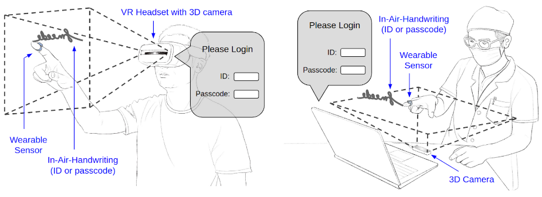
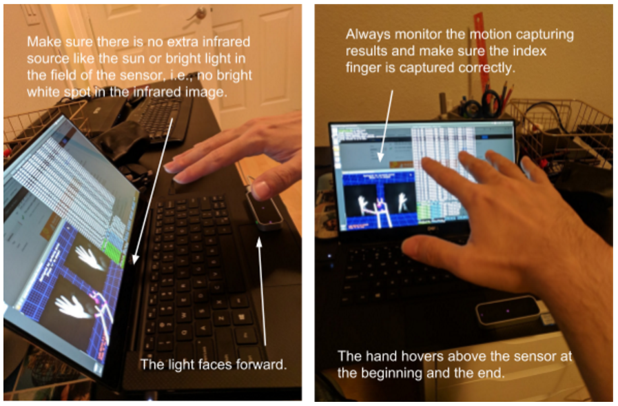

# FMKit - A Finger Motion Analysis Library and Data Repository

FMKit is a library and data repository for finger motion based user login and in-air-handwriting analysis.

## The FMKit Library

The FMKit library contains a set of Python code and scripts to model and process in-air-handwriting signals. See the "code" folder. An overview is shown as follows.

* code/fmkit ---> The main library code. 
  * The "core" module contains the classes modeling the finger motion signal. 
  * The "vis" module contains functions to plot and animate the signal and the trajectory.
  * The "utils" module contains common utility code.
* code/test ---> Testing code, which can be considered as some examples of using the library.
* code/data_temp ---> Some example in-air-handwriting signals, collected using two devices.

Here only the core of the library is uploaded. The majority of the library is still mainly under development. Most of the code that generates the results in the papers are quite messy and not well documented. They will be gradually uploaded once the code is cleaned and annotated.

## The Data Repository

Here is a description of the dataset we have collected to facilitate our research on in-air-handwriting passcode and biometrics. We have IRB approval of this data collection (Arizona State University STUDY00008279). Two devices are used (shown in the following figure): a wearable device (a custom-made data glove with inertial sensors) and a contactless 3D camera (the Leap Motion controller). The data repository contains the following five datasets.

**(1) Sign-up and Sign-in**: We asked each participating user to create two distinct meaningful strings and write them in-the-air, one as an account ID and the other as an account passcode. Such a string may include alphanumeric letters, characters in a language other than English, or meaningful symbols such as five-pointed stars. The requirements of the account ID and the account passcode are the same. Hence, each string can be used as either an ID or a passcode. For each string, we asked the user to write it 5 repetitions as registration and another 5 repetitions as login attempts. This simulates the normal sign-up and sign-in procedure (shown in the following figure). In total 129 users participated the data collection and 258 strings are obtained. 

**(2) Spoofing with Semantic Leakage**: We asked 10 skilled imposters to imitate the in-air-handwriting of the ID and password generated by the users in the first dataset. In this setting, the imposters know the semantic meaning of the strings written by the legitimate users, but the imposters have not seen the legitimate users writing the ID and password in the air, which simulates spoofing attack with semantic leakage. All strings in the first dataset are spoofed and each imposter wrote every string with 5 repetitions using both two devices for data collection. In total, there are 258 * 10 * 5 * 2 = 25,800 data samples.

**(3) Spoofing with both Semantic and Visual Leakage**: We asked 10 skilled imposters to imitate the in-air-handwriting of the ID and password generated by the users in the first dataset.
In this setting, the imposters can watch the recorded video of the in-air-handwriting and they will be informed with the semantic meaning of the in-air-handwriting. 132 strings in the first dataset are spoofed and each imposter wrote the string with 5 repetitions using both two devices for data collection. In total, there are 132 * 10 * 5 * 2 = 13,200 data samples.

**(4) Long-Term Persistence Study**: We kept collecting the sign-in in-air-handwriting of a subset of the users in the first dataset for a period of about 4 weeks, which simulates login activity in the long term. Similar to the procedure in the first dataset, the user wrote each string 5 repetitions as registration. After that, the users wrote the strings for the account ID and the account passcode 5 repetitions in a single day as a session, and at least 2 sessions each week, in total 10 sessions at least. 22 users participated this dataset and in total there are 44 * 5 * 2 + 44 * 10 * 5 * 2 = 4,840 data samples.

**(5) In-Air-Handwriting Words**: We asked 10 users to write 210 English words and 210 Chinese words with 5 repetitions for each word with both devices. In total, there are 2 * 210 * 10 * 5 * 2 = 42,000 data samples.

**(6) Usability Survey**: We asked the participating users to fill a survey on the usability of gesture sign-in system with various sensors and different types of gestures. 72 users responded to the survey.

## Data Collection Instructions

Here are some detailed instructions for the Leap Motion controller.

For the sign-up and sign-in dataset, three Linux terminals should be opened, one for the Leap Motion daemon process (for typing "sudo leapd"), one for the Leap Motion control panel (for typing "LeapControlPanel"), and the last for the actual data collection program (for typing "python ./sensor_leap.py xxx.txt". At the beginning of writing each string, the participant should hover the hand above the sensor, like that in the following figure. Once the data collection starts, i.e., immediately after the "sensor_leap.py" script executes, the hand should start to move. At the end of writing, the hand should restore to the initial position. The participant can write from left to right or just write every letter at the same place.

The captured handwriting signal is individually named. For the ID string, it is "id_id_xx.txt", where "xx" the sequence number of the repetition. For example, if the ID string is "duolu", the file is named as "duolu_duolu_01.txt" for the first repetition. For the passcode, similarly, it is "id_passcode_xx.txt". For example, if the ID string is "duolu" and the passcode is "fmcode", the file name is "duolu_fmcode_01.txt". In this way, we can immediately know who writes what in the file directly from the file name.

For the spoofing dataset, the procedure of spoofing with semantic leakage is similar to that in sign-up and sign-in, but with only 5 repetitions for each string. The file name is in the format of "spoofer_string_xx.txt". For example, if the participant is designated to be "spoofer08", and the spoofed string is "fmcode", the file name is "spoofer08_fmcode_01.txt" for the first repetition. For the spoofing with both semantic and visual leakage dataset, the procedure and file name convention are the same.

For the long-term persistant study dataset, the procedure and file name convention are the same as sign-up and sign-in. However, the sequence number of repetitions will linearly increase. For example, if the ID string is "duolu" and the passcode is "fmcode", for the registration, the file name will be "duolu_fmcode_01.txt" to "duolu_fmcode_05.txt". For the first login session, the file names will be "duolu_fmcode_06.txt" to "duolu_fmcode_10.txt". Similarly, for the second login session, the file names will be increased to "duolu_fmcode_11.txt" to "duolu_fmcode_15.txt", and so on.

For the in-air-handwriting words dataset, the procedure and file name convention are the same as spoofing with semantic leakage. Instead of using "spoofer", "user" is used in the file name. For example, if the participant is designated as "user08", and it writes the English words "agree", for the first repetition, the file name would be "user08_agree_01.txt". For Chinese words, a pinyin label is used to denote what is written.

## Data Format

The finger motion signal (i.e., instances of the "FMSignal" class) is time series containing samples of physical states of the fingers obtained from a user writing some string in a certain language in the air. It is also commonly called in-air-handwriting or just handwriting for short. Typically only the tip of the index finger is considered, and the physical states contains position, angular pose, speed, angular speed, linear acceleration, and angular acceleration. 

The time series is denoted as s = ( s1, s2, ..., sl ), and each si = ( si1, si2, ..., sid ), where l is the number of samples and d is the sensor dimension. Typically the samples are generated at a constant rate and each sample si is associated with a timestamp tsi. A signal can have a user label u and a content label v, denoting the user who generates this signal and the content. These two labels are typically strings. For spoofing attack signals, they have the same content label as the attacked signals but different user labels. All signals with the same user label and content label forms a set S = { s(1), s(2), ..., s(k) }. In a set, each signal has a sequence id k, denoting the index of the signal in the dataset. For signals in the long-term persistence study, each signal has an additional session label w, denoting which session it is obtained. The session label is always an integer. If the session label is 0, it means that the signals is obtained in the same session as registration. A set S may be partitioned into multiple sessions. However, the sequence id is unique for each signal in the set regardless of sessions.

Since a set of signals S is obtained from the same user writing the same content, they have the same user label and content label if used in identification or recognition tasks. A template t can be generated by aligning all signals in S to the first signal and summing them up. In this way, the template has exact same format as an ordinary signal. The aligning process is typically done through Dynamic Time Warping (DTW), which is also widely used for signal comparison and authentication task.

A signal s is usually stored as a matrix with l rows and d + 1 columns, where the first column is the timestamp tsi, and each row in the remaining columns corresponds to si.

## Authors

* **Duo Lu < duolu AT asu DOT edu >** - main contributor, current maintainer of the project.
* **Yuli Deng < ydeng19 AT asu DOT edu >** - contributor.
* **Dijiang Huang < dijiang.huang AT asu DOT edu >** - our academic advisor and sponsor.

## Papers

* Duo Lu, Dijiang Huang, "**FMCode: A 3D In-the-Air Finger Motion Based User Login Framework for Gesture Interface.**" *arXiv preprint arXiv:1808.00130, 2018.* [[pdf]](/papers/fmcode.pdf) [[link]](https://arxiv.org/abs/1808.00130)
* Duo Lu, Dijiang Huang, "**FMHash: Deep Hashing of In-Air-Handwriting for User Identification.**" *arXiv preprint arXiv:1806.03574, 2018.* [[pdf]](/papers/fmhash.pdf) [[link]](https://arxiv.org/abs/1806.03574)
* Duo Lu, Dijiang Huang, Yuli Deng, and Adel Alshamrani. "**Multifactor user authentication with in-air-handwriting and hand geometry.**" *In 2018 International Conference on Biometrics (ICB), 2018.* [[pdf]](/papers/multifactor.pdf) [[link]](https://ieeexplore.ieee.org/document/8411230) [[slides]](/papers/multifactor_slides.pdf) [[poster]](/papers/multifactor_poster.pdf)
* Duo Lu, Kai Xu, and Dijiang Huang, "**A Data Driven In-Air-Handwriting Biometric Authentication System.**", *in Proceedings of the International Joint Conference on Biometrics (IJCB), 2017.* [[pdf]](/papers/data-driven.pdf) [[link]](https://ieeexplore.ieee.org/document/8272739) [[slides]](/papers/data-driven_slides.pdf)

## License

This project is licensed under the MIT License - see the [LICENSE.md](LICENSE.md) file for details

## Acknowledgments

We would like to thank all participants and volunteers who helped us collecting the data.
